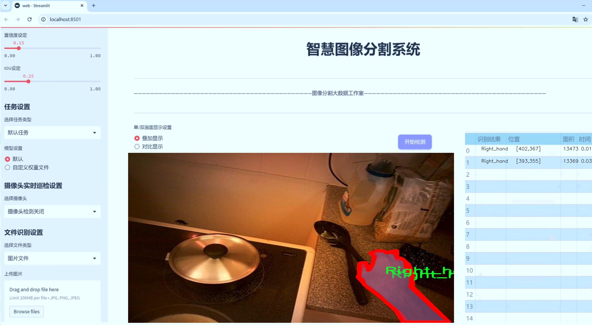

# 手部交互分割系统源码＆数据集分享
 [yolov8-seg-C2f-DLKA＆yolov8-seg等50+全套改进创新点发刊_一键训练教程_Web前端展示]

### 1.研究背景与意义

项目参考[ILSVRC ImageNet Large Scale Visual Recognition Challenge](https://gitee.com/YOLOv8_YOLOv11_Segmentation_Studio/projects)

项目来源[AAAI Global Al lnnovation Contest](https://kdocs.cn/l/cszuIiCKVNis)

研究背景与意义

随着人机交互技术的迅速发展，手势识别与分割技术在虚拟现实、增强现实以及智能家居等领域的应用日益广泛。手部作为人类最灵活的肢体之一，其动作和姿态不仅是人类表达意图的重要方式，也是人机交互中不可或缺的元素。传统的手势识别方法往往依赖于复杂的硬件设备和算法，难以实现实时性和高精度的要求。因此，基于深度学习的手部交互分割系统逐渐成为研究的热点。

在众多深度学习模型中，YOLO（You Only Look Once）系列因其出色的实时检测能力和较高的准确率而备受关注。YOLOv8作为该系列的最新版本，进一步提升了模型的性能和适用性。然而，现有的YOLOv8模型在处理复杂场景下的手部交互分割任务时，仍存在一定的局限性，尤其是在手部交叠、遮挡等情况下的分割精度不足。因此，改进YOLOv8以适应手部交互分割的需求，具有重要的研究价值和实际意义。

本研究所采用的数据集GTEA_GAZE_PLUS_Instance，包含1100张图像和7个类别，涵盖了不同的手部交互场景。该数据集不仅提供了丰富的手部实例信息，还包括了交叉手势的标注，能够有效支持模型在复杂环境下的训练与评估。通过对该数据集的深入分析，我们可以识别出手部交互的多样性与复杂性，从而为改进YOLOv8模型提供更为精准的训练数据。

手部交互分割系统的改进，不仅能够提升模型在手势识别中的准确性和鲁棒性，还能为实际应用提供更为可靠的技术支持。例如，在虚拟现实中，用户的手势可以直接影响虚拟对象的操作，精确的手部分割将极大提升用户体验。在智能家居中，用户通过手势控制家电的需求日益增加，改进的手部交互分割系统将使得这一过程更加自然和流畅。

此外，手部交互分割技术的进步也将推动相关领域的研究发展。通过与其他计算机视觉任务的结合，如目标检测、行为识别等，可以实现更为复杂的交互场景，拓展人机交互的边界。未来，基于改进YOLOv8的手部交互分割系统将不仅限于手势识别，还可以应用于手部动作分析、情感识别等多种场景，为人机交互的智能化提供新的思路和方法。

综上所述，基于改进YOLOv8的手部交互分割系统的研究，不仅具有重要的理论意义，也具备广泛的应用前景。通过对手部交互的深入理解与分析，我们期望能够推动手势识别技术的进步，为实现更加智能化的人机交互奠定坚实的基础。

### 2.图片演示




##### 注意：由于此博客编辑较早，上面“2.图片演示”和“3.视频演示”展示的系统图片或者视频可能为老版本，新版本在老版本的基础上升级如下：（实际效果以升级的新版本为准）

  （1）适配了YOLOV8的“目标检测”模型和“实例分割”模型，通过加载相应的权重（.pt）文件即可自适应加载模型。

  （2）支持“图片识别”、“视频识别”、“摄像头实时识别”三种识别模式。

  （3）支持“图片识别”、“视频识别”、“摄像头实时识别”三种识别结果保存导出，解决手动导出（容易卡顿出现爆内存）存在的问题，识别完自动保存结果并导出到tempDir中。

  （4）支持Web前端系统中的标题、背景图等自定义修改，后面提供修改教程。

  另外本项目提供训练的数据集和训练教程,暂不提供权重文件（best.pt）,需要您按照教程进行训练后实现图片演示和Web前端界面演示的效果。

### 3.视频演示

[3.1 视频演示](https://www.bilibili.com/video/BV1pF2UYcEY8/)

### 4.数据集信息展示

##### 4.1 本项目数据集详细数据（类别数＆类别名）

nc: 3
names: ['Intersecting_hands', 'Left_hand', 'Right_hand']


##### 4.2 本项目数据集信息介绍

数据集信息展示

在本研究中，我们使用了名为“GTEA_GAZE_PLUS_Instance”的数据集，以训练和改进YOLOv8-seg手部交互分割系统。该数据集专注于手部交互的细节，尤其是在复杂场景中对手部的精确分割与识别。通过这一数据集，我们能够有效地捕捉到手部在不同交互状态下的表现，进而提升模型在实际应用中的准确性和鲁棒性。

“GTEA_GAZE_PLUS_Instance”数据集包含了三种主要的类别，分别是“Intersecting_hands”、“Left_hand”和“Right_hand”。这三类手部交互的细分，使得模型在训练过程中能够学习到不同手部姿态和交互方式的特征。具体而言，“Intersecting_hands”类别代表了两只手相互交叉或重叠的状态，这在许多日常活动中都非常常见，例如握手、传递物品等。这一类别的存在，帮助模型理解在复杂交互中如何准确地分割和识别手部区域。

“Left_hand”和“Right_hand”类别则分别专注于左手和右手的独立识别。这种分类不仅提高了模型对单手操作的识别能力，也为手部动作的细致分析提供了基础。例如，在某些应用场景中，左手和右手可能会执行不同的任务，了解这两者的独立性对提升系统的智能化水平至关重要。通过对这三类的训练，YOLOv8-seg能够在处理手部交互时，提供更为精确的分割结果，从而实现更高效的手势识别和交互反馈。

数据集的构建过程中，采用了多样化的场景和背景，以确保模型在不同环境下的适应性。这种多样性不仅包括不同的光照条件、背景杂乱程度，还涵盖了多种手部动作和交互方式。这一策略使得模型在训练过程中能够接触到丰富的样本，增强了其泛化能力，减少了在实际应用中可能出现的过拟合现象。

在数据集的标注方面，采用了高精度的实例分割技术，确保每一帧图像中的手部区域都被准确地标注。这种精细的标注方式，为后续的模型训练提供了坚实的基础，使得YOLOv8-seg能够在处理手部交互时，精准地识别和分割出每一只手的轮廓和位置。这一过程不仅提升了模型的性能，也为后续的研究提供了可重复性和可靠性。

总之，“GTEA_GAZE_PLUS_Instance”数据集为手部交互分割系统的训练提供了丰富而高质量的样本，通过对手部交互的细致分类与标注，助力于YOLOv8-seg在复杂场景中的应用。未来的研究将继续探索如何进一步优化模型，以实现更高效的手势识别和交互系统，推动人机交互技术的发展。


### 5.全套项目环境部署视频教程（零基础手把手教学）

[5.1 环境部署教程链接（零基础手把手教学）](https://www.bilibili.com/video/BV1jG4Ve4E9t/?vd_source=bc9aec86d164b67a7004b996143742dc)


[5.2 安装Python虚拟环境创建和依赖库安装视频教程链接（零基础手把手教学）](https://www.bilibili.com/video/BV1nA4VeYEze/?vd_source=bc9aec86d164b67a7004b996143742dc)

### 6.手把手YOLOV8-seg训练视频教程（零基础小白有手就能学会）

[6.1 手把手YOLOV8-seg训练视频教程（零基础小白有手就能学会）](https://www.bilibili.com/video/BV1cA4VeYETe/?vd_source=bc9aec86d164b67a7004b996143742dc)


按照上面的训练视频教程链接加载项目提供的数据集，运行train.py即可开始训练



     Epoch   gpu_mem       box       obj       cls    labels  img_size
     1/200     0G   0.01576   0.01955  0.007536        22      1280: 100%|██████████| 849/849 [14:42<00:00,  1.04s/it]
               Class     Images     Labels          P          R     mAP@.5 mAP@.5:.95: 100%|██████████| 213/213 [01:14<00:00,  2.87it/s]
                 all       3395      17314      0.994      0.957      0.0957      0.0843

     Epoch   gpu_mem       box       obj       cls    labels  img_size
     2/200     0G   0.01578   0.01923  0.007006        22      1280: 100%|██████████| 849/849 [14:44<00:00,  1.04s/it]
               Class     Images     Labels          P          R     mAP@.5 mAP@.5:.95: 100%|██████████| 213/213 [01:12<00:00,  2.95it/s]
                 all       3395      17314      0.996      0.956      0.0957      0.0845

     Epoch   gpu_mem       box       obj       cls    labels  img_size
     3/200     0G   0.01561    0.0191  0.006895        27      1280: 100%|██████████| 849/849 [10:56<00:00,  1.29it/s]
               Class     Images     Labels          P          R     mAP@.5 mAP@.5:.95: 100%|███████   | 187/213 [00:52<00:00,  4.04it/s]
                 all       3395      17314      0.996      0.957      0.0957      0.0845


### 7.50+种全套YOLOV8-seg创新点代码加载调参视频教程（一键加载写好的改进模型的配置文件）

[7.1 50+种全套YOLOV8-seg创新点代码加载调参视频教程（一键加载写好的改进模型的配置文件）](https://www.bilibili.com/video/BV1Hw4VePEXv/?vd_source=bc9aec86d164b67a7004b996143742dc)

### 8.YOLOV8-seg图像分割算法原理

原始YOLOv8-seg算法原理

YOLOv8-seg算法作为YOLO系列的最新版本，承载着目标检测与分割任务的双重使命，展现了深度学习领域在计算机视觉方面的最新进展。该算法的设计理念基于YOLOv5的成功经验，并在此基础上进行了全面的优化与升级，旨在提高模型的性能、效率与适用性。YOLOv8-seg不仅延续了YOLO系列的实时性和高精度特性，还通过引入轻量化设计和新颖的网络结构，进一步提升了对复杂场景的处理能力。

在YOLOv8-seg的架构中，模型主要由三个核心部分构成：Backbone、Neck和Head。Backbone部分负责特征提取，采用了一系列卷积和反卷积层，结合残差连接和瓶颈结构，旨在减少网络的参数量和计算复杂度。特别地，YOLOv8-seg在Backbone中引入了C2F模块，替代了YOLOv5中的C3模块，显著提升了特征提取的效率。C2F模块通过使用3×3的卷积核和深度为3的设计，使得特征提取更加精细，能够更好地捕捉到目标的细节信息。

Neck部分则采用了多尺度特征融合技术，通过特征金字塔网络（FPN）和路径聚合网络（PAN）的结合，增强了模型对不同尺度目标的检测能力。BiFPN网络的引入，使得YOLOv8-seg在特征融合时能够实现高效的双向跨尺度连接，并通过加权特征融合来提升特征的表达能力。这种设计不仅提高了模型对小目标的检测性能，还增强了其在复杂场景下的鲁棒性。

在Head部分，YOLOv8-seg使用了轻量化的解耦头，替代了传统的耦合头结构。这一创新使得模型在进行目标检测时，能够更灵活地处理不同尺寸的目标信息。通过引入有错目标检测的机制，YOLOv8-seg能够在面对复杂背景和遮挡情况时，依然保持较高的检测精度。此外，YOLOv8-seg还采用了新的损失策略，通过变焦损失计算分类损失，结合数据平均保真度损失和完美交并比损失来优化边界框的回归。这种损失计算方式，使得模型在训练过程中能够更有效地学习到目标的特征，从而提升了整体的检测性能。

YOLOv8-seg的设计不仅关注模型的精度和效率，还特别考虑了实际应用中的多样性和灵活性。该算法支持多种不同的网络结构，包括YOLOv8n、YOLOv8s、YOLOv8m、YOLOv8l和YOLOv8x等，这些不同版本的模型在Backbone的层数和残差块的数量上有所区别，但基本原理保持一致。这种灵活的设计使得用户可以根据具体的应用场景和计算资源，选择最合适的模型版本，从而实现最佳的性能与效率平衡。

在实际应用中，YOLOv8-seg的高效性和准确性使其在多个领域展现出广泛的应用潜力。无论是在自动驾驶、安防监控，还是在医疗影像分析中，YOLOv8-seg都能够提供实时的目标检测与分割服务，帮助用户快速获取所需信息。此外，YOLOv8-seg还具备良好的可扩展性，能够与其他深度学习技术相结合，进一步提升应用效果。

综上所述，YOLOv8-seg算法通过一系列创新设计，成功实现了目标检测与分割的高效融合。其轻量化的网络结构、先进的特征融合技术以及灵活的模型选择，赋予了YOLOv8-seg在复杂视觉任务中的强大能力。随着深度学习技术的不断发展，YOLOv8-seg无疑将在未来的计算机视觉应用中发挥更加重要的作用。


### 9.系统功能展示（检测对象为举例，实际内容以本项目数据集为准）

图9.1.系统支持检测结果表格显示

  图9.2.系统支持置信度和IOU阈值手动调节

  图9.3.系统支持自定义加载权重文件best.pt(需要你通过步骤5中训练获得)

  图9.4.系统支持摄像头实时识别

  图9.5.系统支持图片识别

  图9.6.系统支持视频识别

  图9.7.系统支持识别结果文件自动保存

  图9.8.系统支持Excel导出检测结果数据


### 10.50+种全套YOLOV8-seg创新点原理讲解（非科班也可以轻松写刊发刊，V11版本正在科研待更新）

#### 10.1 由于篇幅限制，每个创新点的具体原理讲解就不一一展开，具体见下列网址中的创新点对应子项目的技术原理博客网址【Blog】：


[10.1 50+种全套YOLOV8-seg创新点原理讲解链接](https://gitee.com/qunmasj/good)

#### 10.2 部分改进模块原理讲解(完整的改进原理见上图和技术博客链接)【如果此小节的图加载失败可以通过CSDN或者Github搜索该博客的标题访问原始博客，原始博客图片显示正常】

### YOLOv8简介
#### Backbone
Darknet-53
53指的是“52层卷积”+output layer。

借鉴了其他算法的这些设计思想

借鉴了VGG的思想，使用了较多的3×3卷积，在每一次池化操作后，将通道数翻倍；

借鉴了network in network的思想，使用全局平均池化（global average pooling）做预测，并把1×1的卷积核置于3×3的卷积核之间，用来压缩特征；（我没找到这一步体现在哪里）


使用了批归一化层稳定模型训练，加速收敛，并且起到正则化作用。

    以上三点为Darknet19借鉴其他模型的点。Darknet53当然是在继承了Darknet19的这些优点的基础上再新增了下面这些优点的。因此列在了这里

借鉴了ResNet的思想，在网络中大量使用了残差连接，因此网络结构可以设计的很深，并且缓解了训练中梯度消失的问题，使得模型更容易收敛。

使用步长为2的卷积层代替池化层实现降采样。（这一点在经典的Darknet-53上是很明显的，output的长和宽从256降到128，再降低到64，一路降低到8，应该是通过步长为2的卷积层实现的；在YOLOv8的卷积层中也有体现，比如图中我标出的这些位置）

#### 特征融合

模型架构图如下

  Darknet-53的特点可以这样概括：（Conv卷积模块+Residual Block残差块）串行叠加4次

  Conv卷积层+Residual Block残差网络就被称为一个stage


上面红色指出的那个，原始的Darknet-53里面有一层 卷积，在YOLOv8里面，把一层卷积移除了

为什么移除呢？

        原始Darknet-53模型中间加的这个卷积层做了什么？滤波器（卷积核）的个数从 上一个卷积层的512个，先增加到1024个卷积核，然后下一层卷积的卷积核的个数又降低到512个

        移除掉这一层以后，少了1024个卷积核，就可以少做1024次卷积运算，同时也少了1024个3×3的卷积核的参数，也就是少了9×1024个参数需要拟合。这样可以大大减少了模型的参数，（相当于做了轻量化吧）

        移除掉这个卷积层，可能是因为作者发现移除掉这个卷积层以后，模型的score有所提升，所以才移除掉的。为什么移除掉以后，分数有所提高呢？可能是因为多了这些参数就容易，参数过多导致模型在训练集删过拟合，但是在测试集上表现很差，最终模型的分数比较低。你移除掉这个卷积层以后，参数减少了，过拟合现象不那么严重了，泛化能力增强了。当然这个是，拿着你做实验的结论，反过来再找补，再去强行解释这种现象的合理性。


通过MMdetection官方绘制册这个图我们可以看到，进来的这张图片经过一个“Feature Pyramid Network(简称FPN)”，然后最后的P3、P4、P5传递给下一层的Neck和Head去做识别任务。 PAN（Path Aggregation Network）


“FPN是自顶向下，将高层的强语义特征传递下来。PAN就是在FPN的后面添加一个自底向上的金字塔，对FPN补充，将低层的强定位特征传递上去，

FPN是自顶（小尺寸，卷积次数多得到的结果，语义信息丰富）向下（大尺寸，卷积次数少得到的结果），将高层的强语义特征传递下来，对整个金字塔进行增强，不过只增强了语义信息，对定位信息没有传递。PAN就是针对这一点，在FPN的后面添加一个自底（卷积次数少，大尺寸）向上（卷积次数多，小尺寸，语义信息丰富）的金字塔，对FPN补充，将低层的强定位特征传递上去，又被称之为“双塔战术”。

FPN层自顶向下传达强语义特征，而特征金字塔则自底向上传达强定位特征，两两联手，从不同的主干层对不同的检测层进行参数聚合,这样的操作确实很皮。
#### 自底向上增强


而 PAN（Path Aggregation Network）是对 FPN 的一种改进，它的设计理念是在 FPN 后面添加一个自底向上的金字塔。PAN 引入了路径聚合的方式，通过将浅层特征图（低分辨率但语义信息较弱）和深层特征图（高分辨率但语义信息丰富）进行聚合，并沿着特定的路径传递特征信息，将低层的强定位特征传递上去。这样的操作能够进一步增强多尺度特征的表达能力，使得 PAN 在目标检测任务中表现更加优秀。


### Gold-YOLO简介
YOLO系列模型面世至今已有8年，由于其优异的性能，已成为目标检测领域的标杆。在系列模型经过十多个不同版本的改进发展逐渐稳定完善的今天，研究人员更多关注于单个计算模块内结构的精细调整，或是head部分和训练方法上的改进。但这并不意味着现有模式已是最优解。

当前YOLO系列模型通常采用类FPN方法进行信息融合，而这一结构在融合跨层信息时存在信息损失的问题。针对这一问题，我们提出了全新的信息聚集-分发（Gather-and-Distribute Mechanism）GD机制，通过在全局视野上对不同层级的特征进行统一的聚集融合并分发注入到不同层级中，构建更加充分高效的信息交互融合机制，并基于GD机制构建了Gold-YOLO。在COCO数据集中，我们的Gold-YOLO超越了现有的YOLO系列，实现了精度-速度曲线上的SOTA。


精度和速度曲线（TensorRT7）


精度和速度曲线（TensorRT8）
传统YOLO的问题
在检测模型中，通常先经过backbone提取得到一系列不同层级的特征，FPN利用了backbone的这一特点，构建了相应的融合结构：不层级的特征包含着不同大小物体的位置信息，虽然这些特征包含的信息不同，但这些特征在相互融合后能够互相弥补彼此缺失的信息，增强每一层级信息的丰富程度，提升网络性能。

原始的FPN结构由于其层层递进的信息融合模式，使得相邻层的信息能够充分融合，但也导致了跨层信息融合存在问题：当跨层的信息进行交互融合时，由于没有直连的交互通路，只能依靠中间层充当“中介”进行融合，导致了一定的信息损失。之前的许多工作中都关注到了这一问题，而解决方案通常是通过添加shortcut增加更多的路径，以增强信息流动。

然而传统的FPN结构即便改进后，由于网络中路径过多，且交互方式不直接，基于FPN思想的信息融合结构仍然存在跨层信息交互困难和信息损失的问题。

#### Gold-YOLO：全新的信息融合交互机制


#### Gold-YOLO架构
参考该博客提出的一种全新的信息交互融合机制：信息聚集-分发机制(Gather-and-Distribute Mechanism)。该机制通过在全局上融合不同层次的特征得到全局信息，并将全局信息注入到不同层级的特征中，实现了高效的信息交互和融合。在不显著增加延迟的情况下GD机制显著增强了Neck部分的信息融合能力，提高了模型对不同大小物体的检测能力。

GD机制通过三个模块实现：信息对齐模块(FAM)、信息融合模块(IFM)和信息注入模块(Inject)。

信息对齐模块负责收集并对齐不同层级不同大小的特征

信息融合模块通过使用卷积或Transformer算子对对齐后的的特征进行融合，得到全局信息

信息注入模块将全局信息注入到不同层级中

在Gold-YOLO中，针对模型需要检测不同大小的物体的需要，并权衡精度和速度，我们构建了两个GD分支对信息进行融合：低层级信息聚集-分发分支(Low-GD)和高层级信息聚集-分发分支(High-GD)，分别基于卷积和transformer提取和融合特征信息。

此外,为了促进局部信息的流动，我们借鉴现有工作，构建了一个轻量级的邻接层融合模块，该模块在局部尺度上结合了邻近层的特征，进一步提升了模型性能。我们还引入并验证了预训练方法对YOLO模型的有效性，通过在ImageNet 1K上使用MAE方法对主干进行预训练，显著提高了模型的收敛速度和精度。


### 11.项目核心源码讲解（再也不用担心看不懂代码逻辑）

#### 11.1 ultralytics\nn\backbone\EfficientFormerV2.py

以下是对给定代码的核心部分进行提炼和详细注释的结果。保留了模型的主要结构和功能，同时对每个类和方法进行了中文注释。

```python
import torch
import torch.nn as nn
import math
import itertools

# 定义EfficientFormer的宽度和深度配置
EfficientFormer_width = {
    'L': [40, 80, 192, 384],
    'S2': [32, 64, 144, 288],
    'S1': [32, 48, 120, 224],
    'S0': [32, 48, 96, 176],
}

EfficientFormer_depth = {
    'L': [5, 5, 15, 10],
    'S2': [4, 4, 12, 8],
    'S1': [3, 3, 9, 6],
    'S0': [2, 2, 6, 4],
}

# 定义4D注意力机制
class Attention4D(nn.Module):
    def __init__(self, dim=384, key_dim=32, num_heads=8, attn_ratio=4, resolution=7):
        super().__init__()
        self.num_heads = num_heads
        self.scale = key_dim ** -0.5  # 缩放因子
        self.resolution = resolution
        self.N = resolution ** 2  # 分辨率的平方

        # 定义查询、键、值的卷积层
        self.q = nn.Conv2d(dim, num_heads * key_dim, kernel_size=1)
        self.k = nn.Conv2d(dim, num_heads * key_dim, kernel_size=1)
        self.v = nn.Conv2d(dim, num_heads * attn_ratio * key_dim, kernel_size=1)

        # 注意力偏置参数
        self.attention_biases = nn.Parameter(torch.zeros(num_heads, len(self._get_attention_offsets())))

    def _get_attention_offsets(self):
        # 计算注意力偏置的索引
        points = list(itertools.product(range(self.resolution), repeat=2))
        idxs = []
        for p1 in points:
            for p2 in points:
                offset = (abs(p1[0] - p2[0]), abs(p1[1] - p2[1]))
                idxs.append(offset)
        return idxs

    def forward(self, x):
        B, C, H, W = x.shape
        q = self.q(x).view(B, self.num_heads, -1, self.N).permute(0, 1, 3, 2)  # 查询
        k = self.k(x).view(B, self.num_heads, -1, self.N).permute(0, 1, 2, 3)  # 键
        v = self.v(x).view(B, self.num_heads, -1, self.N).permute(0, 1, 3, 2)  # 值

        # 计算注意力分数
        attn = (q @ k) * self.scale + self.attention_biases
        attn = attn.softmax(dim=-1)  # softmax归一化

        # 应用注意力
        x = (attn @ v).permute(0, 1, 3, 2).view(B, -1, self.resolution, self.resolution)
        return x

# 定义MLP模块
class Mlp(nn.Module):
    def __init__(self, in_features, hidden_features=None, out_features=None):
        super().__init__()
        hidden_features = hidden_features or in_features
        self.fc1 = nn.Conv2d(in_features, hidden_features, kernel_size=1)
        self.fc2 = nn.Conv2d(hidden_features, out_features or in_features, kernel_size=1)

    def forward(self, x):
        x = self.fc1(x)
        x = torch.relu(x)  # 激活函数
        x = self.fc2(x)
        return x

# 定义EfficientFormerV2模型
class EfficientFormerV2(nn.Module):
    def __init__(self, layers, embed_dims):
        super().__init__()
        self.patch_embed = nn.Conv2d(3, embed_dims[0], kernel_size=3, stride=2, padding=1)  # 初始嵌入层
        self.network = nn.ModuleList()

        # 构建网络的各个层
        for i in range(len(layers)):
            stage = self._build_stage(embed_dims[i], layers[i])
            self.network.append(stage)

    def _build_stage(self, dim, layers):
        blocks = []
        for _ in range(layers):
            blocks.append(Attention4D(dim=dim))  # 添加注意力模块
            blocks.append(Mlp(in_features=dim))  # 添加MLP模块
        return nn.Sequential(*blocks)

    def forward(self, x):
        x = self.patch_embed(x)  # 输入图像经过嵌入层
        for block in self.network:
            x = block(x)  # 逐层前向传播
        return x

# 创建不同配置的EfficientFormerV2模型
def efficientformerv2_s0():
    return EfficientFormerV2(layers=EfficientFormer_depth['S0'], embed_dims=EfficientFormer_width['S0'])

def efficientformerv2_s1():
    return EfficientFormerV2(layers=EfficientFormer_depth['S1'], embed_dims=EfficientFormer_width['S1'])

def efficientformerv2_s2():
    return EfficientFormerV2(layers=EfficientFormer_depth['S2'], embed_dims=EfficientFormer_width['S2'])

def efficientformerv2_l():
    return EfficientFormerV2(layers=EfficientFormer_depth['L'], embed_dims=EfficientFormer_width['L'])

if __name__ == '__main__':
    inputs = torch.randn((1, 3, 640, 640))  # 输入样本
    model = efficientformerv2_s0()  # 创建S0模型
    res = model(inputs)  # 前向传播
    print(res.size())  # 输出结果尺寸
```

### 代码说明：
1. **Attention4D类**：实现了4D注意力机制，包含查询、键、值的卷积层，以及计算注意力分数的逻辑。
2. **Mlp类**：实现了一个简单的多层感知机（MLP），使用1x1卷积进行特征变换。
3. **EfficientFormerV2类**：构建了整个EfficientFormerV2模型，包含嵌入层和多个注意力及MLP模块的堆叠。
4. **模型创建函数**：提供了不同规模的EfficientFormerV2模型的创建接口。

通过这种方式，代码的结构和功能得以保留，同时注释提供了清晰的理解。

这个文件实现了一个名为 `EfficientFormerV2` 的深度学习模型，主要用于计算机视觉任务，特别是图像分类。模型的设计灵感来源于 Transformer 架构，并结合了卷积神经网络（CNN）的特性，以提高效率和性能。

首先，文件中定义了一些模型的超参数，包括不同规模的模型的宽度和深度，这些参数存储在字典 `EfficientFormer_width` 和 `EfficientFormer_depth` 中。不同的模型规模（如 S0、S1、S2 和 L）对应不同的层数和通道数。

接下来，文件中定义了多个类，构成了模型的核心组件。`Attention4D` 类实现了一个四维注意力机制，支持多头注意力和可选的下采样。它的构造函数中初始化了多个卷积层和注意力相关的参数。`forward` 方法实现了前向传播，计算输入特征图的注意力输出。

`stem` 函数定义了模型的初始卷积层，负责将输入图像转换为特征图。`LGQuery` 类实现了局部和全局查询的结合，增强了模型对不同尺度特征的捕捉能力。

`Attention4DDownsample` 类则实现了下采样的注意力机制，结合了局部卷积和全局注意力，进一步提高了模型的表达能力。

`Embedding` 类负责将输入图像嵌入到一个高维空间中，并可选择使用轻量级或带注意力的嵌入方式。`Mlp` 类实现了多层感知机，使用 1x1 卷积来进行特征变换。

`AttnFFN` 和 `FFN` 类分别实现了带注意力的前馈网络和普通前馈网络，二者结合了注意力机制和多层感知机，增强了模型的非线性表达能力。

`eformer_block` 函数用于构建模型的每个块，结合了注意力机制和前馈网络，形成一个完整的层级结构。`EfficientFormerV2` 类则是整个模型的主体，负责将各个块组合在一起，并定义了前向传播的逻辑。

最后，文件提供了多个函数（如 `efficientformerv2_s0`、`efficientformerv2_s1` 等）用于创建不同规模的模型，并加载预训练权重。`update_weight` 函数用于更新模型的权重，确保加载的权重与模型结构匹配。

在 `__main__` 部分，文件演示了如何实例化不同规模的模型，并对随机生成的输入进行前向传播，输出每个模型的特征图尺寸。这为模型的使用提供了示例，方便用户理解如何在实际应用中使用该模型。

#### 11.2 ultralytics\utils\callbacks\__init__.py

以下是代码中最核心的部分，并附上详细的中文注释：

```python
# 导入所需的函数和模块
from .base import add_integration_callbacks, default_callbacks, get_default_callbacks

# 定义模块的公开接口，指定可以被外部访问的名称
__all__ = 'add_integration_callbacks', 'default_callbacks', 'get_default_callbacks'
```

### 注释说明：

1. **导入模块**：
   - `from .base import add_integration_callbacks, default_callbacks, get_default_callbacks`：从当前包的 `base` 模块中导入三个函数或变量。这些函数可能用于添加集成回调、获取默认回调等功能。

2. **定义公开接口**：
   - `__all__` 是一个特殊变量，用于定义当使用 `from module import *` 语句时，哪些名称是可以被导入的。在这里，`add_integration_callbacks`、`default_callbacks` 和 `get_default_callbacks` 被列为公开接口，意味着它们是模块的主要功能部分，用户可以直接使用这些功能。

这个程序文件是Ultralytics YOLO项目中的一个模块，主要用于回调函数的管理。文件的开头包含了版权信息，表明该代码遵循AGPL-3.0许可证。

在文件中，首先从同一目录下的`base`模块导入了三个函数：`add_integration_callbacks`、`default_callbacks`和`get_default_callbacks`。这些函数的具体功能可能与回调机制的集成、默认回调的定义以及获取默认回调的方式有关。

最后，`__all__`变量被定义为一个元组，包含了这三个函数的名称。这意味着当使用`from ultralytics.utils.callbacks import *`这种方式导入时，只会导入`__all__`中列出的名称，从而控制模块的公共接口，避免不必要的名称泄露。

总的来说，这个文件的主要作用是提供一个接口，方便其他模块或文件使用与回调相关的功能。

#### 11.3 ultralytics\engine\model.py

以下是代码中最核心的部分，并附上详细的中文注释：

```python
class Model(nn.Module):
    """
    模型基类，用于统一所有模型的API。

    参数:
        model (str, Path): 要加载或创建的模型文件路径。
        task (Any, optional): YOLO模型的任务类型。默认为None。

    属性:
        predictor (Any): 预测器对象。
        model (Any): 模型对象。
        trainer (Any): 训练器对象。
        task (str): 模型任务类型。
        ckpt (Any): 如果模型是从*.pt文件加载的，则为检查点对象。
        cfg (str): 如果从*.yaml文件加载，则为模型配置。
        ckpt_path (str): 检查点文件路径。
        overrides (dict): 训练器对象的覆盖参数。
        metrics (Any): 用于度量的数据。
    """

    def __init__(self, model: Union[str, Path] = 'yolov8n.pt', task=None) -> None:
        """
        初始化YOLO模型。

        参数:
            model (Union[str, Path], optional): 要加载或创建的模型路径或名称。默认为'yolov8n.pt'。
            task (Any, optional): YOLO模型的任务类型。默认为None。
        """
        super().__init__()
        self.predictor = None  # 预测器对象
        self.model = None  # 模型对象
        self.trainer = None  # 训练器对象
        self.task = task  # 任务类型
        model = str(model).strip()  # 去除模型名称的空格

        # 检查是否为Ultralytics HUB模型
        if self.is_hub_model(model):
            from ultralytics.hub.session import HUBTrainingSession
            self.session = HUBTrainingSession(model)  # 创建HUB训练会话
            model = self.session.model_file  # 获取模型文件

        # 加载或创建新的YOLO模型
        suffix = Path(model).suffix  # 获取模型文件后缀
        if suffix in ('.yaml', '.yml'):
            self._new(model, task)  # 从配置文件创建新模型
        else:
            self._load(model, task)  # 从权重文件加载模型

    def predict(self, source=None, stream=False, predictor=None, **kwargs):
        """
        使用YOLO模型进行预测。

        参数:
            source (str | int | PIL | np.ndarray): 要进行预测的图像来源。
            stream (bool): 是否流式传输预测结果。默认为False。
            predictor (BasePredictor): 自定义预测器。
            **kwargs : 传递给预测器的其他关键字参数。

        返回:
            (List[ultralytics.engine.results.Results]): 预测结果。
        """
        if source is None:
            source = ASSETS  # 如果没有提供source，则使用默认资产
        # 处理预测器的初始化和设置
        if not self.predictor:
            self.predictor = (predictor or self._smart_load('predictor'))(overrides=kwargs)
            self.predictor.setup_model(model=self.model)  # 设置模型
        return self.predictor(source=source, stream=stream)  # 返回预测结果

    def _load(self, weights: str, task=None):
        """
        从权重文件加载模型并推断任务类型。

        参数:
            weights (str): 要加载的模型检查点。
            task (str | None): 模型任务。
        """
        self.model, self.ckpt = attempt_load_one_weight(weights)  # 尝试加载权重
        self.task = self.model.args['task']  # 获取任务类型
        self.overrides['model'] = weights  # 设置覆盖参数

    def _new(self, cfg: str, task=None):
        """
        从配置文件初始化新模型并推断任务类型。

        参数:
            cfg (str): 模型配置文件。
            task (str | None): 模型任务。
        """
        cfg_dict = yaml_model_load(cfg)  # 加载配置文件
        self.task = task or guess_model_task(cfg_dict)  # 推断任务类型
        self.model = self._smart_load('model')(cfg_dict)  # 创建模型

    def is_hub_model(self, model):
        """检查提供的模型是否为HUB模型。"""
        return model.startswith(f'{HUB_WEB_ROOT}/models/')  # 检查模型是否以HUB根路径开头

    def _smart_load(self, key):
        """加载模型/训练器/验证器/预测器。"""
        return self.task_map[self.task][key]  # 根据任务类型获取相应的类
```

### 代码核心部分说明：
1. **Model类**：这是一个基类，统一了YOLO模型的API。它负责初始化模型、加载权重、进行预测等功能。
2. **初始化方法**：根据传入的模型路径或名称，判断模型的类型（HUB模型、权重文件或配置文件），并进行相应的加载。
3. **预测方法**：提供了对外的预测接口，处理输入源并调用预测器进行预测。
4. **加载模型**：提供了从权重文件和配置文件加载模型的功能，推断任务类型。
5. **HUB模型检查**：用于判断给定的模型路径是否为HUB模型。
6. **智能加载**：根据任务类型动态加载相应的模型、训练器、验证器或预测器。

这个程序文件是Ultralytics YOLO模型的实现，主要用于统一不同YOLO模型的API。它定义了一个`Model`类，包含了模型的初始化、加载、预测、训练等多种功能。

在`__init__`方法中，模型可以通过路径或名称进行加载，默认加载的是'yolov8n.pt'。在初始化过程中，程序会检查模型是否来自Ultralytics HUB或Triton Server，并相应地处理。如果模型是一个路径，程序会根据文件后缀来决定是加载新的模型还是创建新的模型实例。

`__call__`方法是对`predict`方法的一个别名，允许用户直接调用模型实例进行预测。`is_triton_model`和`is_hub_model`是静态方法，用于判断给定的模型是否为Triton Server模型或Ultralytics HUB模型。

`_new`和`_load`方法分别用于初始化新的模型和加载已有的模型权重。`_check_is_pytorch_model`方法用于检查当前模型是否为PyTorch模型，如果不是则抛出类型错误。

模型的其他功能包括重置权重、加载权重、获取模型信息、融合模型层、进行预测、对象跟踪、模型验证、基准测试、导出模型、训练模型以及超参数调优等。每个功能都有相应的方法，接受不同的参数并返回结果。

例如，`predict`方法用于进行预测，接受图像源、流式处理标志和其他参数，返回预测结果。`train`方法用于训练模型，支持自定义训练器和训练配置。

此外，模型还提供了回调机制，允许用户在特定事件发生时执行自定义函数。通过`add_callback`、`clear_callback`和`reset_callbacks`等方法，用户可以管理回调函数。

最后，`task_map`属性是一个映射，用于将任务类型映射到相应的模型、训练器、验证器和预测器类，虽然在此文件中并未具体实现。

整体而言，这个文件提供了一个灵活且功能丰富的接口，方便用户使用YOLO模型进行各种计算机视觉任务。

#### 11.4 train.py

以下是代码中最核心的部分，并附上详细的中文注释：

```python
import os
import torch
import yaml
from ultralytics import YOLO  # 导入YOLO模型库

if __name__ == '__main__':  # 确保该模块被直接运行时才执行以下代码
    # 设置训练参数
    workers = 1  # 数据加载的工作进程数
    batch = 8  # 每个批次的样本数量，视显存和内存情况调整
    device = "0" if torch.cuda.is_available() else "cpu"  # 检查是否有可用的GPU

    # 获取数据集配置文件的绝对路径
    data_path = abs_path(f'datasets/data/data.yaml', path_type='current')

    # 将路径格式转换为Unix风格
    unix_style_path = data_path.replace(os.sep, '/')
    # 获取数据集目录路径
    directory_path = os.path.dirname(unix_style_path)

    # 读取YAML配置文件
    with open(data_path, 'r') as file:
        data = yaml.load(file, Loader=yaml.FullLoader)

    # 检查并修改数据集路径
    if 'train' in data and 'val' in data and 'test' in data:
        data['train'] = directory_path + '/train'  # 更新训练集路径
        data['val'] = directory_path + '/val'      # 更新验证集路径
        data['test'] = directory_path + '/test'    # 更新测试集路径

        # 将修改后的数据写回YAML文件
        with open(data_path, 'w') as file:
            yaml.safe_dump(data, file, sort_keys=False)

    # 加载YOLO模型配置和预训练权重
    model = YOLO(r"C:\codeseg\codenew\50+种YOLOv8算法改进源码大全和调试加载训练教程（非必要）\改进YOLOv8模型配置文件\yolov8-seg-C2f-Faster.yaml").load("./weights/yolov8s-seg.pt")

    # 开始训练模型
    results = model.train(
        data=data_path,  # 指定训练数据的配置文件路径
        device=device,  # 使用的设备（GPU或CPU）
        workers=workers,  # 数据加载的工作进程数
        imgsz=640,  # 输入图像的大小为640x640
        epochs=100,  # 训练100个epoch
        batch=batch,  # 每个批次的大小为8
    )
```

### 代码注释说明：
1. **导入必要的库**：导入了处理文件路径、深度学习框架（PyTorch）、YAML文件解析和YOLO模型的库。
2. **主程序入口**：通过`if __name__ == '__main__':`确保只有在直接运行该脚本时才执行后续代码。
3. **训练参数设置**：设置了数据加载的工作进程数、批次大小和设备（GPU或CPU）。
4. **数据集路径处理**：获取数据集配置文件的绝对路径，并将其转换为Unix风格的路径格式。
5. **读取和修改YAML文件**：读取YAML文件中的数据集路径，检查并更新训练、验证和测试集的路径，然后将修改后的内容写回文件。
6. **加载YOLO模型**：根据指定的配置文件和预训练权重加载YOLO模型。
7. **模型训练**：调用`model.train()`方法开始训练，传入数据路径、设备、工作进程数、图像大小、训练轮数和批次大小等参数。

该程序文件`train.py`主要用于训练YOLO（You Only Look Once）模型，具体是YOLOv8版本的一个变体。程序的结构相对简单，主要包括以下几个部分。

首先，程序导入了必要的库，包括`os`、`torch`、`yaml`、`ultralytics`中的YOLO模型以及`matplotlib`。`matplotlib`被设置为使用'TkAgg'后端，这通常用于图形界面的绘图。

接下来，程序通过`if __name__ == '__main__':`确保只有在直接运行该脚本时才会执行以下代码。程序设置了一些基本参数，包括工作进程数`workers`、批次大小`batch`和设备类型`device`。设备类型的选择基于是否有可用的GPU，如果有则使用GPU（设备编号为"0"），否则使用CPU。

然后，程序定义了数据集的配置文件路径，使用`abs_path`函数获取该路径的绝对路径。接着，程序将路径中的分隔符统一替换为Unix风格的斜杠，以确保在不同操作系统上的兼容性。程序获取了数据集目录的路径，并打开YAML文件读取数据集的配置信息。

在读取YAML文件后，程序检查是否包含'train'、'val'和'test'字段。如果这些字段存在，程序将其路径修改为基于当前目录的相对路径，并将修改后的数据写回到YAML文件中。这样做的目的是确保模型能够正确找到训练、验证和测试数据集。

接下来，程序加载YOLO模型的配置文件和预训练权重。这里使用的是一个特定的YOLOv8模型配置文件，并指定了预训练模型的路径。用户可以根据需要选择不同的模型配置文件。

最后，程序调用`model.train()`方法开始训练模型。训练的参数包括数据配置文件路径、设备类型、工作进程数、输入图像大小（640x640）、训练的轮数（100个epoch）以及每个批次的大小（8）。训练完成后，模型将根据提供的数据进行优化。

整体而言，该程序实现了YOLOv8模型的训练流程，包括数据集的配置、模型的加载以及训练过程的启动。

#### 11.5 ultralytics\data\converter.py

以下是代码中最核心的部分，并附上详细的中文注释：

```python
def coco91_to_coco80_class():
    """
    将91个COCO类ID转换为80个COCO类ID。

    返回:
        (list): 一个包含91个类ID的列表，其中索引表示80个类ID，值为对应的91个类ID。
    """
    return [
        0, 1, 2, 3, 4, 5, 6, 7, 8, 9, 10, None, 11, 12, 13, 14, 15, 16, 17, 18, 19, 20, 21, 22, 23, None, 24, 25, None,
        None, 26, 27, 28, 29, 30, 31, 32, 33, 34, 35, 36, 37, 38, 39, None, 40, 41, 42, 43, 44, 45, 46, 47, 48, 49, 50,
        51, 52, 53, 54, 55, 56, 57, 58, 59, None, 60, None, None, 61, None, 62, 63, 64, 65, 66, 67, 68, 69, 70, 71, 72,
        None, 73, 74, 75, 76, 77, 78, 79, None]

def convert_coco(labels_dir='../coco/annotations/',
                 save_dir='coco_converted/',
                 use_segments=False,
                 use_keypoints=False,
                 cls91to80=True):
    """
    将COCO数据集的注释转换为适合训练YOLO模型的YOLO注释格式。

    参数:
        labels_dir (str, optional): 包含COCO数据集注释文件的目录路径。
        save_dir (str, optional): 保存结果的目录路径。
        use_segments (bool, optional): 是否在输出中包含分割掩码。
        use_keypoints (bool, optional): 是否在输出中包含关键点注释。
        cls91to80 (bool, optional): 是否将91个COCO类ID映射到对应的80个COCO类ID。

    输出:
        在指定的输出目录中生成输出文件。
    """

    # 创建数据集目录
    save_dir = increment_path(save_dir)  # 如果保存目录已存在，则增加后缀
    for p in save_dir / 'labels', save_dir / 'images':
        p.mkdir(parents=True, exist_ok=True)  # 创建目录

    # 转换类
    coco80 = coco91_to_coco80_class()

    # 导入json文件
    for json_file in sorted(Path(labels_dir).resolve().glob('*.json')):
        fn = Path(save_dir) / 'labels' / json_file.stem.replace('instances_', '')  # 文件夹名称
        fn.mkdir(parents=True, exist_ok=True)
        with open(json_file) as f:
            data = json.load(f)

        # 创建图像字典
        images = {f'{x["id"]:d}': x for x in data['images']}
        # 创建图像-注释字典
        imgToAnns = defaultdict(list)
        for ann in data['annotations']:
            imgToAnns[ann['image_id']].append(ann)

        # 写入标签文件
        for img_id, anns in TQDM(imgToAnns.items(), desc=f'Annotations {json_file}'):
            img = images[f'{img_id:d}']
            h, w, f = img['height'], img['width'], img['file_name']

            bboxes = []  # 存储边界框
            segments = []  # 存储分割
            keypoints = []  # 存储关键点
            for ann in anns:
                if ann['iscrowd']:
                    continue  # 跳过人群注释
                # COCO框格式为 [左上角x, 左上角y, 宽度, 高度]
                box = np.array(ann['bbox'], dtype=np.float64)
                box[:2] += box[2:] / 2  # 将左上角坐标转换为中心坐标
                box[[0, 2]] /= w  # 归一化x坐标
                box[[1, 3]] /= h  # 归一化y坐标
                if box[2] <= 0 or box[3] <= 0:  # 如果宽度或高度小于等于0
                    continue

                cls = coco80[ann['category_id'] - 1] if cls91to80 else ann['category_id'] - 1  # 类别
                box = [cls] + box.tolist()  # 将类别和边界框合并
                if box not in bboxes:
                    bboxes.append(box)  # 添加边界框
                if use_segments and ann.get('segmentation') is not None:
                    # 处理分割
                    if len(ann['segmentation']) == 0:
                        segments.append([])
                        continue
                    elif len(ann['segmentation']) > 1:
                        s = merge_multi_segment(ann['segmentation'])  # 合并多个分割
                        s = (np.concatenate(s, axis=0) / np.array([w, h])).reshape(-1).tolist()
                    else:
                        s = [j for i in ann['segmentation'] for j in i]  # 所有分割连接
                        s = (np.array(s).reshape(-1, 2) / np.array([w, h])).reshape(-1).tolist()
                    s = [cls] + s
                    if s not in segments:
                        segments.append(s)  # 添加分割
                if use_keypoints and ann.get('keypoints') is not None:
                    keypoints.append(box + (np.array(ann['keypoints']).reshape(-1, 3) /
                                            np.array([w, h, 1])).reshape(-1).tolist())

            # 写入文件
            with open((fn / f).with_suffix('.txt'), 'a') as file:
                for i in range(len(bboxes)):
                    if use_keypoints:
                        line = *(keypoints[i]),  # 类别, 边界框, 关键点
                    else:
                        line = *(segments[i]
                                 if use_segments and len(segments[i]) > 0 else bboxes[i]),  # 类别, 边界框或分割
                    file.write(('%g ' * len(line)).rstrip() % line + '\n')

    LOGGER.info(f'COCO数据成功转换。\n结果保存到 {save_dir.resolve()}')
```

### 代码核心部分解释：
1. **coco91_to_coco80_class**: 该函数用于将COCO数据集中91个类的ID转换为80个类的ID。返回一个列表，其中索引表示80个类的ID，值为对应的91个类的ID。

2. **convert_coco**: 该函数是主要的转换函数，将COCO数据集的注释转换为YOLO格式。它接受多个参数，包括注释文件的目录、保存结果的目录、是否使用分割和关键点等。函数首先创建保存目录，然后读取COCO的JSON注释文件，解析图像和注释信息，最后将处理后的数据写入YOLO格式的文本文件中。

3. **边界框处理**: 在处理每个注释时，函数会将COCO的边界框格式转换为YOLO格式，归一化坐标，并将类别ID转换为所需的格式。

4. **分割和关键点处理**: 如果需要，函数还会处理分割信息和关键点信息，并将其格式化为YOLO所需的格式。

5. **文件写入**: 最后，函数将所有处理后的信息写入到指定的文本文件中，以便后续训练YOLO模型时使用。

这个程序文件主要用于将COCO数据集的标注格式转换为YOLO模型所需的标注格式。文件中包含多个函数，分别实现不同的功能。

首先，`coco91_to_coco80_class`和`coco80_to_coco91_class`两个函数用于在COCO数据集中不同的类别ID之间进行转换。COCO数据集的类别ID有91个，而YOLO模型通常使用80个类别ID。第一个函数返回一个列表，其中每个索引代表80个类别ID，值为对应的91个类别ID。第二个函数则执行相反的操作。

接下来，`convert_coco`函数是文件的核心功能，它负责将COCO数据集的标注文件转换为YOLO格式。该函数接受多个参数，包括标注文件的目录、保存结果的目录、是否使用分割掩码和关键点等。函数首先创建保存结果的目录，并根据需要创建子目录。然后，它会读取指定目录下的所有JSON格式的标注文件，并将其解析为字典形式，方便后续处理。

在处理每个图像的标注时，函数会提取图像的高度、宽度和文件名，并根据标注信息生成YOLO格式的边界框。边界框的坐标会被归一化到[0, 1]的范围内。函数还会根据需要处理分割和关键点信息，并将结果写入相应的文本文件中。

`convert_dota_to_yolo_obb`函数则用于将DOTA数据集的标注转换为YOLO的有向边界框格式。它会遍历DOTA数据集中的训练和验证图像，读取原始标签并将其转换为YOLO格式。函数中定义了一个内部函数`convert_label`，用于处理单个图像的标签转换。

此外，`min_index`函数用于找到两个二维点数组之间距离最短的点对索引，而`merge_multi_segment`函数则用于合并多个分割线段，将它们连接成一个连续的线段。

总的来说，这个程序文件提供了从COCO和DOTA数据集转换标注格式的功能，便于用户将这些数据集用于YOLO模型的训练。通过调用相应的函数，用户可以轻松地将数据集的标注转换为YOLO所需的格式。

#### 11.6 ultralytics\utils\atss.py

以下是经过简化和注释的核心代码部分，主要保留了生成锚框和计算IoU的功能：

```python
import torch
import torch.nn as nn
import torch.nn.functional as F

def generate_anchors(feats, fpn_strides, grid_cell_size=5.0, grid_cell_offset=0.5, device='cpu', is_eval=False, mode='af'):
    '''根据特征生成锚框。'''
    anchors = []  # 存储锚框
    anchor_points = []  # 存储锚点
    stride_tensor = []  # 存储步幅
    num_anchors_list = []  # 存储每层锚框数量

    assert feats is not None  # 确保特征不为空

    # 评估模式
    if is_eval:
        for i, stride in enumerate(fpn_strides):
            _, _, h, w = feats[i].shape  # 获取特征图的高度和宽度
            shift_x = torch.arange(end=w, device=device) + grid_cell_offset  # x方向的偏移
            shift_y = torch.arange(end=h, device=device) + grid_cell_offset  # y方向的偏移
            shift_y, shift_x = torch.meshgrid(shift_y, shift_x, indexing='ij')  # 创建网格
            anchor_point = torch.stack([shift_x, shift_y], axis=-1).to(torch.float)  # 生成锚点

            if mode == 'af':  # anchor-free模式
                anchor_points.append(anchor_point.reshape([-1, 2]))  # 将锚点展平
                stride_tensor.append(torch.full((h * w, 1), stride, dtype=torch.float, device=device))  # 生成步幅张量
            elif mode == 'ab':  # anchor-based模式
                anchor_points.append(anchor_point.reshape([-1, 2]).repeat(3, 1))  # 复制锚点
                stride_tensor.append(torch.full((h * w, 1), stride, dtype=torch.float, device=device).repeat(3, 1))  # 复制步幅张量

        anchor_points = torch.cat(anchor_points)  # 合并锚点
        stride_tensor = torch.cat(stride_tensor)  # 合并步幅
        return anchor_points, stride_tensor  # 返回锚点和步幅

    # 非评估模式
    else:
        for i, stride in enumerate(fpn_strides):
            _, _, h, w = feats[i].shape  # 获取特征图的高度和宽度
            cell_half_size = grid_cell_size * stride * 0.5  # 计算单元格的一半大小
            shift_x = (torch.arange(end=w, device=device) + grid_cell_offset) * stride  # x方向的偏移
            shift_y = (torch.arange(end=h, device=device) + grid_cell_offset) * stride  # y方向的偏移
            shift_y, shift_x = torch.meshgrid(shift_y, shift_x, indexing='ij')  # 创建网格

            # 生成锚框
            anchor = torch.stack(
                [
                    shift_x - cell_half_size, shift_y - cell_half_size,
                    shift_x + cell_half_size, shift_y + cell_half_size
                ],
                axis=-1).clone().to(feats[0].dtype)

            anchor_point = torch.stack([shift_x, shift_y], axis=-1).clone().to(feats[0].dtype)  # 生成锚点

            if mode == 'af':  # anchor-free模式
                anchors.append(anchor.reshape([-1, 4]))  # 将锚框展平
                anchor_points.append(anchor_point.reshape([-1, 2]))  # 将锚点展平
            elif mode == 'ab':  # anchor-based模式
                anchors.append(anchor.reshape([-1, 4]).repeat(3, 1))  # 复制锚框
                anchor_points.append(anchor_point.reshape([-1, 2]).repeat(3, 1))  # 复制锚点

            num_anchors_list.append(len(anchors[-1]))  # 记录锚框数量
            stride_tensor.append(torch.full([num_anchors_list[-1], 1], stride, dtype=feats[0].dtype))  # 生成步幅张量

        anchors = torch.cat(anchors)  # 合并锚框
        anchor_points = torch.cat(anchor_points).to(device)  # 合并锚点并转移到指定设备
        stride_tensor = torch.cat(stride_tensor).to(device)  # 合并步幅并转移到指定设备
        return anchors, anchor_points, num_anchors_list, stride_tensor  # 返回锚框、锚点、锚框数量和步幅

def bbox_overlaps(bboxes1, bboxes2, mode='iou', is_aligned=False, eps=1e-6):
    """计算两个bbox集合之间的重叠区域（IoU）。"""
    assert mode in ['iou', 'iof', 'giou'], f'不支持的模式 {mode}'  # 确保模式有效
    assert (bboxes1.size(-1) == 4 or bboxes1.size(0) == 0)  # 确保bboxes1有效
    assert (bboxes2.size(-1) == 4 or bboxes2.size(0) == 0)  # 确保bboxes2有效

    # 批次维度必须相同
    assert bboxes1.shape[:-2] == bboxes2.shape[:-2]
    batch_shape = bboxes1.shape[:-2]  # 获取批次形状

    rows = bboxes1.size(-2)  # bboxes1的数量
    cols = bboxes2.size(-2)  # bboxes2的数量
    if is_aligned:
        assert rows == cols  # 如果对齐，数量必须相同

    if rows * cols == 0:  # 如果没有框
        if is_aligned:
            return bboxes1.new(batch_shape + (rows, ))  # 返回形状
        else:
            return bboxes1.new(batch_shape + (rows, cols))  # 返回形状

    # 计算面积
    area1 = (bboxes1[..., 2] - bboxes1[..., 0]) * (bboxes1[..., 3] - bboxes1[..., 1])
    area2 = (bboxes2[..., 2] - bboxes2[..., 0]) * (bboxes2[..., 3] - bboxes2[..., 1])

    # 计算重叠区域
    lt = torch.max(bboxes1[..., :2], bboxes2[..., :2])  # 左上角
    rb = torch.min(bboxes1[..., 2:], bboxes2[..., 2:])  # 右下角
    wh = (rb - lt).clamp(min=0)  # 宽高
    overlap = wh[..., 0] * wh[..., 1]  # 重叠面积

    # 计算联合面积
    union = area1 + area2 - overlap + eps  # 加上小的epsilon以避免除零
    ious = overlap / union  # 计算IoU

    return ious  # 返回IoU
```

### 代码说明
1. **generate_anchors**: 该函数根据输入特征生成锚框和锚点。支持两种模式：anchor-free和anchor-based。
   - 在评估模式下，仅生成锚点和步幅。
   - 在训练模式下，生成锚框、锚点、锚框数量和步幅。

2. **bbox_overlaps**: 该函数计算两个边界框集合之间的重叠区域（IoU）。
   - 输入为两个边界框集合，支持对齐和不同模式（IoU、IoF、GIoU）。
   - 计算每对边界框的重叠面积和联合面积，最终返回IoU值。

以上是代码的核心部分和详细注释，保留了主要功能和结构。

这个程序文件主要实现了一个自适应训练样本选择分配器（ATSSAssigner），用于目标检测任务中的锚框分配。文件中包含多个函数和一个类，具体功能如下：

首先，`generate_anchors`函数用于根据特征图生成锚框。它接受特征图、特征图的步幅、网格单元大小、网格偏移、设备类型、是否为评估模式和模式（锚框自由或锚框基础）作为输入。根据不同的模式，它会计算锚框的坐标并返回锚框和步幅张量。

接下来，`fp16_clamp`函数用于对张量进行数值限制，特别是处理半精度浮点数（FP16）时，确保数值在给定的最小值和最大值之间。

`bbox_overlaps`函数计算两个边界框集合之间的重叠度，支持不同的重叠度计算模式（如IoU、IoF和GIoU）。它考虑了不同的输入形状和批处理维度，并返回重叠度的张量。

`cast_tensor_type`和`iou2d_calculator`函数分别用于将张量转换为特定类型和计算2D边界框之间的重叠度。

`dist_calculator`函数计算真实边界框和锚框之间的中心距离，而`iou_calculator`函数则计算批处理的IoU。

`ATSSAssigner`类是文件的核心部分，继承自`nn.Module`。它的构造函数初始化了一些参数，如topk值和类别数。在`forward`方法中，首先处理输入的锚框、真实边界框和标签。如果没有真实边界框，返回背景标签和零值。接着，计算IoU和距离，并选择候选框。然后，通过阈值计算选择符合条件的正样本，最后获取目标标签、边界框和得分。

类中的其他方法如`select_topk_candidates`、`thres_calculator`和`get_targets`分别用于选择前k个候选框、计算阈值和获取目标信息。

总体而言，这个文件实现了一个复杂的目标检测锚框分配机制，旨在提高训练样本的选择效率和准确性。通过计算重叠度和距离，结合自适应阈值选择，能够更好地处理目标检测中的锚框分配问题。

### 12.系统整体结构（节选）

### 整体功能和构架概括

Ultralytics项目是一个针对计算机视觉任务的深度学习框架，特别专注于目标检测和图像分割。该项目实现了多种模型（如YOLO和RT-DETR），并提供了训练、推理和数据处理的工具。整体架构包括模型定义、数据处理、训练流程、回调机制和可视化工具等多个模块。

1. **模型架构**：通过不同的文件实现了各种深度学习模型的构建和训练，例如EfficientFormer、YOLO等。
2. **数据处理**：提供了数据集格式转换工具，支持COCO和DOTA等数据集的标注格式转换。
3. **训练与推理**：实现了模型的训练和推理功能，支持多种参数配置和回调机制。
4. **可视化与跟踪**：提供了可视化工具和目标跟踪算法，增强了模型的应用能力。

### 文件功能整理表

| 文件路径                                           | 功能描述                                                   |
|--------------------------------------------------|----------------------------------------------------------|
| `ultralytics/nn/backbone/EfficientFormerV2.py`  | 实现EfficientFormerV2模型，包括注意力机制和前馈网络。     |
| `ultralytics/utils/callbacks/__init__.py`       | 管理回调函数，提供集成和默认回调的功能。                   |
| `ultralytics/engine/model.py`                    | 定义YOLO模型的API，包含模型加载、训练和预测等功能。       |
| `train.py`                                       | 训练YOLO模型，配置数据集和训练参数。                      |
| `ultralytics/data/converter.py`                  | 将COCO和DOTA数据集的标注格式转换为YOLO格式。              |
| `ultralytics/utils/atss.py`                      | 实现自适应训练样本选择分配器（ATSS），用于锚框分配。       |
| `ultralytics/trackers/bot_sort.py`              | 实现BOT-SORT目标跟踪算法，处理多目标跟踪任务。             |
| `ultralytics/models/rtdetr/__init__.py`         | 定义RT-DETR模型的接口和初始化功能。                        |
| `ultralytics/utils/plotting.py`                  | 提供可视化工具，用于绘制训练过程中的损失和精度等图表。     |
| `ultralytics/trackers/byte_tracker.py`           | 实现BYTE目标跟踪算法，支持高效的多目标跟踪。               |
| `ui.py`                                          | 提供用户界面功能，可能用于与用户交互或展示结果。           |
| `ultralytics/models/yolo/pose/predict.py`       | 实现YOLO模型的姿态估计预测功能。                          |
| `ultralytics/models/rtdetr/predict.py`           | 实现RT-DETR模型的预测功能，处理输入并返回检测结果。       |

以上表格总结了每个文件的主要功能，展示了Ultralytics项目的模块化设计和功能丰富性。

注意：由于此博客编辑较早，上面“11.项目核心源码讲解（再也不用担心看不懂代码逻辑）”中部分代码可能会优化升级，仅供参考学习，完整“训练源码”、“Web前端界面”和“50+种创新点源码”以“14.完整训练+Web前端界面+50+种创新点源码、数据集获取”的内容为准。

### 13.图片、视频、摄像头图像分割Demo(去除WebUI)代码

在这个博客小节中，我们将讨论如何在不使用WebUI的情况下，实现图像分割模型的使用。本项目代码已经优化整合，方便用户将分割功能嵌入自己的项目中。
核心功能包括图片、视频、摄像头图像的分割，ROI区域的轮廓提取、类别分类、周长计算、面积计算、圆度计算以及颜色提取等。
这些功能提供了良好的二次开发基础。

### 核心代码解读

以下是主要代码片段，我们会为每一块代码进行详细的批注解释：

```python
import random
import cv2
import numpy as np
from PIL import ImageFont, ImageDraw, Image
from hashlib import md5
from model import Web_Detector
from chinese_name_list import Label_list

# 根据名称生成颜色
def generate_color_based_on_name(name):
    ......

# 计算多边形面积
def calculate_polygon_area(points):
    return cv2.contourArea(points.astype(np.float32))

...
# 绘制中文标签
def draw_with_chinese(image, text, position, font_size=20, color=(255, 0, 0)):
    image_pil = Image.fromarray(cv2.cvtColor(image, cv2.COLOR_BGR2RGB))
    draw = ImageDraw.Draw(image_pil)
    font = ImageFont.truetype("simsun.ttc", font_size, encoding="unic")
    draw.text(position, text, font=font, fill=color)
    return cv2.cvtColor(np.array(image_pil), cv2.COLOR_RGB2BGR)

# 动态调整参数
def adjust_parameter(image_size, base_size=1000):
    max_size = max(image_size)
    return max_size / base_size

# 绘制检测结果
def draw_detections(image, info, alpha=0.2):
    name, bbox, conf, cls_id, mask = info['class_name'], info['bbox'], info['score'], info['class_id'], info['mask']
    adjust_param = adjust_parameter(image.shape[:2])
    spacing = int(20 * adjust_param)

    if mask is None:
        x1, y1, x2, y2 = bbox
        aim_frame_area = (x2 - x1) * (y2 - y1)
        cv2.rectangle(image, (x1, y1), (x2, y2), color=(0, 0, 255), thickness=int(3 * adjust_param))
        image = draw_with_chinese(image, name, (x1, y1 - int(30 * adjust_param)), font_size=int(35 * adjust_param))
        y_offset = int(50 * adjust_param)  # 类别名称上方绘制，其下方留出空间
    else:
        mask_points = np.concatenate(mask)
        aim_frame_area = calculate_polygon_area(mask_points)
        mask_color = generate_color_based_on_name(name)
        try:
            overlay = image.copy()
            cv2.fillPoly(overlay, [mask_points.astype(np.int32)], mask_color)
            image = cv2.addWeighted(overlay, 0.3, image, 0.7, 0)
            cv2.drawContours(image, [mask_points.astype(np.int32)], -1, (0, 0, 255), thickness=int(8 * adjust_param))

            # 计算面积、周长、圆度
            area = cv2.contourArea(mask_points.astype(np.int32))
            perimeter = cv2.arcLength(mask_points.astype(np.int32), True)
            ......

            # 计算色彩
            mask = np.zeros(image.shape[:2], dtype=np.uint8)
            cv2.drawContours(mask, [mask_points.astype(np.int32)], -1, 255, -1)
            color_points = cv2.findNonZero(mask)
            ......

            # 绘制类别名称
            x, y = np.min(mask_points, axis=0).astype(int)
            image = draw_with_chinese(image, name, (x, y - int(30 * adjust_param)), font_size=int(35 * adjust_param))
            y_offset = int(50 * adjust_param)

            # 绘制面积、周长、圆度和色彩值
            metrics = [("Area", area), ("Perimeter", perimeter), ("Circularity", circularity), ("Color", color_str)]
            for idx, (metric_name, metric_value) in enumerate(metrics):
                ......

    return image, aim_frame_area

# 处理每帧图像
def process_frame(model, image):
    pre_img = model.preprocess(image)
    pred = model.predict(pre_img)
    det = pred[0] if det is not None and len(det)
    if det:
        det_info = model.postprocess(pred)
        for info in det_info:
            image, _ = draw_detections(image, info)
    return image

if __name__ == "__main__":
    cls_name = Label_list
    model = Web_Detector()
    model.load_model("./weights/yolov8s-seg.pt")

    # 摄像头实时处理
    cap = cv2.VideoCapture(0)
    while cap.isOpened():
        ret, frame = cap.read()
        if not ret:
            break
        ......

    # 图片处理
    image_path = './icon/OIP.jpg'
    image = cv2.imread(image_path)
    if image is not None:
        processed_image = process_frame(model, image)
        ......

    # 视频处理
    video_path = ''  # 输入视频的路径
    cap = cv2.VideoCapture(video_path)
    while cap.isOpened():
        ret, frame = cap.read()
        ......
```


### 14.完整训练+Web前端界面+50+种创新点源码、数据集获取


# [下载链接：https://mbd.pub/o/bread/ZpyZmJdq](https://mbd.pub/o/bread/ZpyZmJdq)